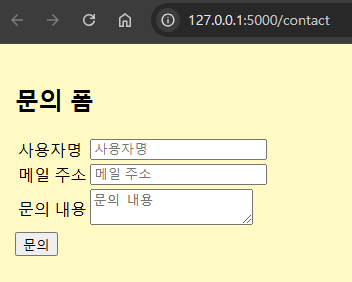

# 📩 Flask 문의 폼 & 이메일 전송 (Flask Contact Form with Email)

이 프로젝트는 **Flask**를 사용하여 **사용자의 문의를 받고 이메일을 자동으로 전송하는 웹 애플리케이션**입니다.  
사용자가 **문의 내용을 작성하고 제출하면** Flask-Mail을 통해 **자동으로 이메일이 발송**됩니다.

  <!-- 📌 스크린샷 필요 -->

---

## 🚀 기능 (Features)
✅ Flask 기반의 문의 폼 웹 애플리케이션  
✅ 사용자의 문의 내용을 이메일로 자동 전송  
✅ Flask-Mail을 사용한 이메일 기능  
✅ 문의 완료 후 **성공 페이지** 제공 (`/contact/success`)  
✅ `session`을 사용하여 데이터 유지  
✅ 환경 변수를 사용하여 보안 강화 (`.env` 지원)  

---

## 📂 폴더 구조 (Project Structure)
/flask-contact-app │── app.py # Flask 애플리케이션 실행 파일 │── requirements.txt # 프로젝트 종속성 (패키지 목록) │── .env # 환경 변수 설정 파일 (비공개) │── /templates # HTML 템플릿 폴더 │ ├── contact.html # 문의 폼 페이지 │ ├── contact_complete.html # 문의 완료 페이지 │ ├── /email │ ├── contact_complete.txt # 이메일 텍스트 템플릿 │ ├── contact_complete.html # 이메일 HTML 템플릿 │── /static # 정적 파일 (CSS, JS 등) │ ├── style.css # 스타일시트 │── /images # 프로젝트 이미지 (스크린샷)

---

## 🔧 설치 및 실행 방법 (Installation & Usage)

### 1️⃣ 프로젝트 클론
```bash
git clone https://github.com/your-repo/flask-contact-app.git
cd flask-contact-app
```
### 2️⃣ 가상환경 생성 및 활성화
 - Windows:

### 3️⃣ 필요한 패키지 설치

```bash
pip install email-validator #이메일 주소(email)가 올바른 형식인지 여부를 체크
pip install flask-mail #이메일을 보내기 위해서 플라스크의 flask-mail 확장을 설치
```

### 4️⃣ 환경 변수 설정 (.env 파일 생성)

.env 파일을 프로젝트 루트 디렉토리에 생성하고 아래와 같이 설정합니다.

```bash
SECRET_KEY=my_super_secret_key_123
MAIL_SERVER=smtp.gmail.com
MAIL_PORT=587
MAIL_USE_TLS=True
MAIL_USE_SSL=False
MAIL_USERNAME=your_email@gmail.com
MAIL_PASSWORD=your_email_password
MAIL_DEFAULT_SENDER=your_email@gmail.com
```
#### 보안 주의: .env 파일은 절대 GitHub 등에 업로드하지 마세요!
#### .gitignore에 추가하는 것이 안전합니다.